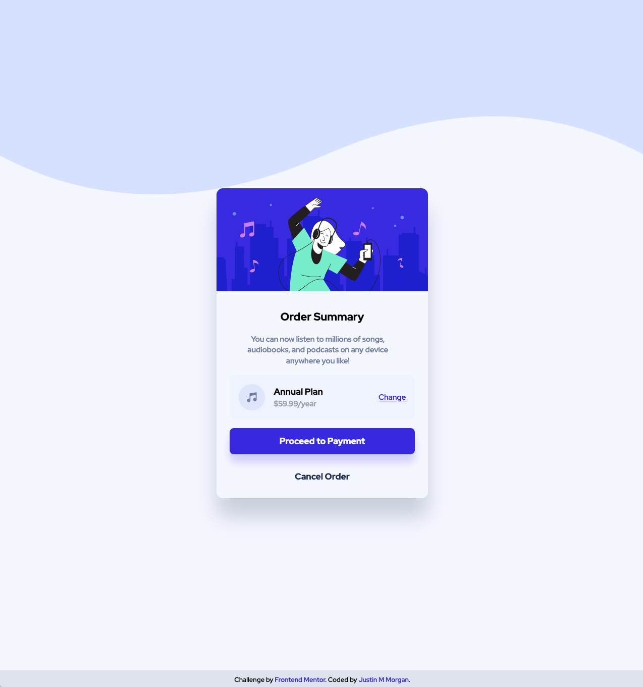

# Frontend Mentor - Order summary card solution

This is a solution to the [Order summary card challenge on Frontend Mentor](https://www.frontendmentor.io/challenges/order-summary-component-QlPmajDUj). Frontend Mentor challenges help you improve your coding skills by building realistic projects. 

## Table of contents

- [Overview](#overview)
  - [The challenge](#the-challenge)
  - [Screenshot](#screenshot)
  - [Links](#links)
- [My process](#my-process)
  - [Built with](#built-with)
  - [What I learned](#what-i-learned)
  - [Continued development](#continued-development)
- [Author](#author)


**Note: Delete this note and update the table of contents based on what sections you keep.**

## Overview

### The challenge

Implement the design from the provided images.

### Screenshots




### Links

- Solution URL: [Add solution URL here](https://your-solution-url.com)
- Live Site URL: [Github Pages](https://justin-m-morgan.github.io/fem_order-summary-component/)

## My process

With this challenge, I decided to go with a static HTML file for the content and TailwindCSS for the styling. My intention was to focus on getting my first Frontend Mentor project complete quickly using tools I was already familiar with. 

My first step in completing this project was establishing the requirements in to the projet configuration file (here `tailwind.config.js`). This included establishing the project color palatte, the urls of the provided images, and including the required font.

I worked in layers from back to front. First I created a background layer that resized to fit the available window space (without fixing a height or leaving a gap on taller screens). This included sizing the provided background SVGs appropriately. The next layer was the "card", which has the appearance of floating in the center of the screen. 

Next I established the markup for the provided content. This involved implementing a heirarhy, grouping items both logically and for styling purposes, and choosing semantic elements (such as buttons vs links, and a definition list). Then I planned a layout which would minimize superfluous elements (used only for layout purposes). 

Lastly was polish. This included assigning the correct colors, shadows, font weights/styles, and controlling element widths to match the style provided in the design images.

### Built with

- Semantic HTML5 markup
- Flexbox
- Mobile-first workflow
- [TailwindCSS](https://tailwindcss.com/)

TailwindCSS is a utility-class based CSS library. It offers a CLI for live-reloading and additional tooling without requiring an additional build tool. Making use of Tailwind requires a thorough understanding of CSS, as the utilities provide normalization with little abstraction. Normalization occurs in several ways:

- implementing a PostCSS build-pipeline to provide fixes, resets, vendor-prefixes, and others benefiets
- resetting many frustrating default stylings, such as link styles, list styles, margin/padding, etc with the `Preflight` base styles
- providing a fixed set of spacing, sizing, and color classes, encouraging project-wide consistency
### What I learned

From this project, I improved my ability to simplify markup. For example, in the "Annual Plan" section, I noticed that the design required several contrary alignment requirements. The icon and two items of text appeared to be left aligned while the "Change" link needed to be right aligned. Unfortunately, the `justify-self` property (available when using CSS-grids) is [not a supported property for flexbox](https://developer.mozilla.org/en-US/docs/Web/CSS/CSS_Box_Alignment/Box_Alignment_in_Flexbox) and so the individual item's justification could not be overridden with flexbox. Rather than switching to a grid (for such a simple layout) or nesting `flex` containers, I decided to solve the problem by remembering a trick learned from Kevin Powell's Youtube channel regarding the use of margins. 

```html
 <div
  class="
    bg-primary-pale bg-opacity-30
    rounded-lg
    flex
    items-center
    px-4
    py-4
  "
>
  
  <dl class="text-left">
    <dt class="font-bold">Annual Plan</dt>
    <dd class="text-sm text-gray-400">$59.99/year</dd>
  </dl>
  <a href="#" class="text-primary-bright underline ml-auto text-sm">Change</a>
</div>
```

By using `margin-left: auto (.ml-auto)`, the link element absorbs the available space between it and the right edge of the flex container and assigns it to it's own left margin (effectively aligning it to the right margin). Taking this approach, I was able to avoid one unneccessary `div`.

### Continued development

In future projects, I want to demonstrate my ability to accomplish the same tasks without relying on the few abstractions provided by TailwindCSS. This includes using (raw) media queries effectively. Tailwind allows for the "tagging" of design properties with screen sizes, which effectively handles media queries and encourages a mobile first approach to design (as the responsive classes are implemented as `min-width`s).

## Author

- Github Profile - [Justin M Morgan](https://github.com/justin-m-morgan)
- Frontend Mentor - [@justin-m-morgan](https://www.frontendmentor.io/profile/justin-m-morgan)
- Twitter - [@_catsonfilm](https://www.twitter.com/_catsonfilm)


